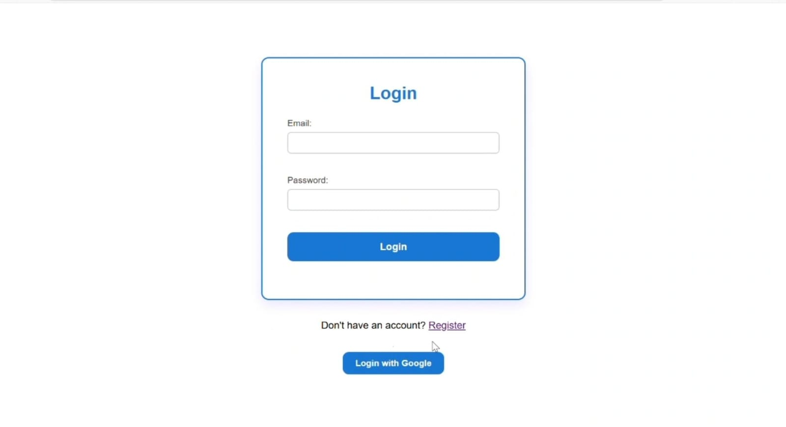
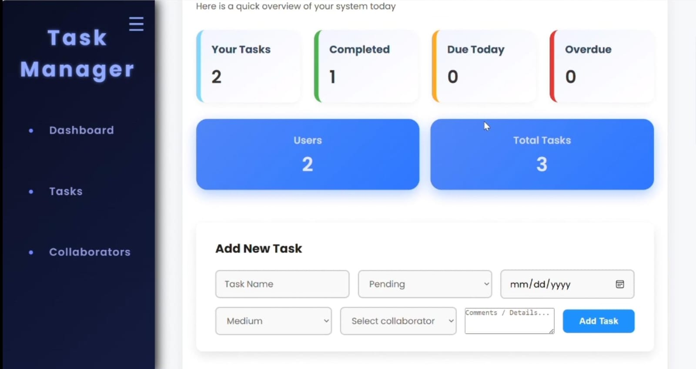
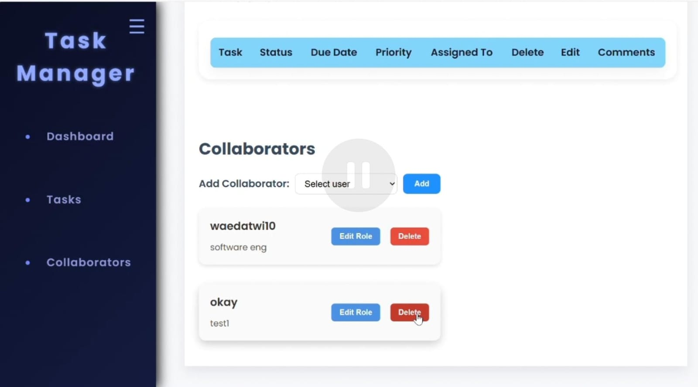
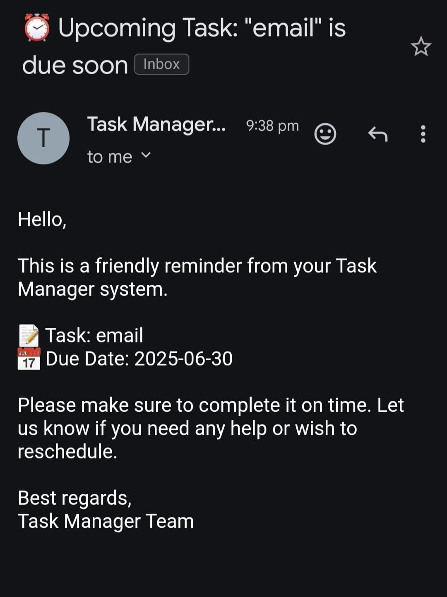

# TaskManager

A full-featured task management application with authentication, collaborative task assignment, and email notifications. Users can manage their tasks, track completed and pending tasks, collaborate with other users, and receive notifications for new tasks.  

## 🚀 Features

- **User Authentication**: Sign up, log in, and log in with **Google OAuth 2.0**
- **Task Management**:
  - Add, edit, and delete tasks
  - Mark tasks as completed
  - View tasks assigned to self or others
  - Track pending, completed, and total tasks
- **Collaborators**: Add collaborators to assign tasks
- **Dashboard**: Overview of tasks, assigned tasks, due tasks, completed tasks, and total users
- **Email Notifications**: Send task details via email when a new task is assigned
- **Secure Backend**: Password hashing with bcrypt, session management, and JWT support

## 🧩 Tech Stack

- **Backend:** Node.js, Express.js  
- **Database:** MongoDB  
- **Authentication:** Passport.js (Local + Google OAuth 2.0)  
- **Email:** Nodemailer  
- **Other:** bcrypt, express-session, cors, cookie-parser  

## 🛠 Installation

1. Clone the repository:

```bash
git clone https://github.com/darkatwi/TaskManager.git
cd TaskManager
````

2. Install dependencies:

```bash
npm install
```

3. Create a `.env` file with the following variables:

```
MONGODB_URI=your_mongodb_connection_string
GOOGLE_CLIENT_ID=your_google_client_id
GOOGLE_CLIENT_SECRET=your_google_client_secret
SESSION_SECRET=your_session_secret
EMAIL_USER=your_email@example.com
EMAIL_PASS=your_email_password
```

4. Start the server:

```bash
npm start
```

5. Open your browser and go to:

```
http://127.0.0.1:5500
```

## 📄 Usage

* **Sign up / Log in**: Use your email or Google account
* **Dashboard**: View pending, completed, and assigned tasks
* **Task Table**: Add, edit, or delete tasks; assign tasks to yourself or collaborators
* **Collaborators**: Add other users to assign tasks collaboratively
* **Email Notifications**: Assigned tasks will trigger an email with the task details

## 🔑 Folder Structure

```
/routes        # API routes (auth, tasks, users, collaborators)
/config        # Passport authentication configuration
/server.js     # Main server file
/package.json  # Project metadata and dependencies
```

## 💡 Future Improvements

* Frontend framework integration (React/Angular/Vue)
* Advanced filtering and search for tasks
* Role-based permissions for collaborators
* Task deadlines with reminders

## 🤝 Contributing

Contributions are welcome!

1. Fork the repo
2. Create a new branch for your feature (`git checkout -b feature-name`)
3. Commit your changes (`git commit -m 'Add feature'`)
4. Push to your branch (`git push origin feature-name`)
5. Open a Pull Request


## 📸 Screenshots

Here are some screenshots of the TaskManager application:

### Login Page


### Dashboard


### Tasks Table


### Collaborators


### Email Reminder

```


